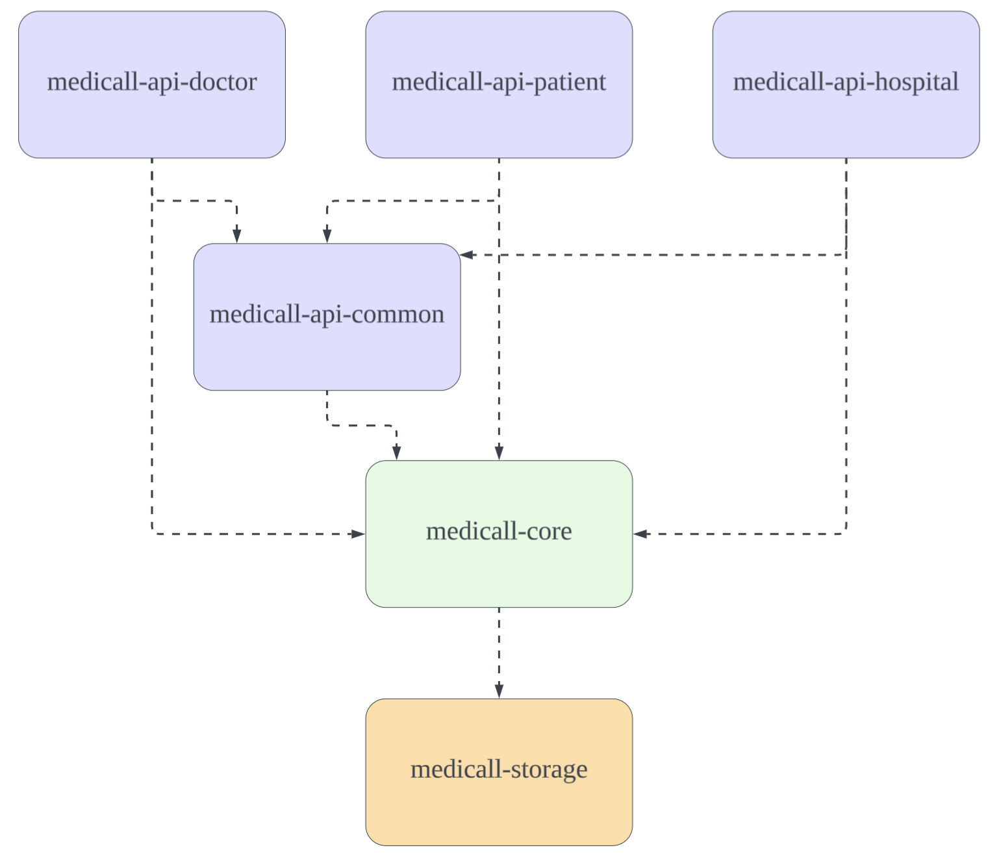

# Medicall - 방문 의료 서비스 

---

## 📋 목차
- [프로젝트 개요](#프로젝트-개요)
- [주요 기능](#주요-기능)
- [기술 스택](#기술-스택)
- [아키텍처](#아키텍처)
- [모듈 구조](#모듈-구조)
- [데이터베이스 스키마](#데이터베이스-스키마)
- [보안](#보안)
- [DTO 네이밍 컨벤션](#dto-네이밍-컨벤션)
- [코딩 컨벤션](#코딩-컨벤션)
- [시작하기](#시작하기)

---

## 프로젝트 개요

의사와 환자, 병원을 상호 연결하는 의료 통합 플랫폼입니다.

정부의 **"일차 의료 방문 진료 수가 시범 사업"**에 영감을 받아, 거동이 불편한 환자들이 겪는 병원 방문의 어려움을 해결하고자 시작한 프로젝트입니다. 의료진과 환자를 효율적으로 연결하는 디지털 플랫폼을 통해 의료 접근성을 향상시키는 것을 목표로 합니다.

---

## 주요 기능

### 👨‍⚕️ 의사
- 예약 관리 및 확인
- 진단 기록 작성 및 관리
- 처방전 작성 및 발행
- 환자 진료 이력 조회

### 👤 환자
- 저장된 주소 기반 주변 병원 검색
- 병원명 및 진료과목별 병원 검색
- 의사 예약 요청 및 관리
- 처방전 QR 코드 조회 및 출력
- 진료 내역 확인

### 🏥 병원
- 소속 의료진 관리
- 예약 현황 관리
- 진료 기록 통합 관리
- 병원 운영 정보 관리

---

## 기술 스택

### Backend
- **Language**: Java 17
- **Framework**: Spring Boot 3.5.5
- **Build Tool**: Gradle 8.14
- **Database**: MySQL 8.x
- **Cache**: Redis 7.x
- **ORM**: Spring Data JPA, QueryDSL
- **Authentication**: JWT (JSON Web Token)

### Infrastructure
- **Containerization**: Docker
- **Multi-stage Build**: Docker Compose

---

## 아키텍처

### 설계 철학

**모노레포 멀티모듈 아키텍처**를 채택하여 환자, 의사, 병원 각각의 독립적인 앱 서비스를 효율적으로 관리합니다.

#### 핵심 원칙
- **관심사의 분리**: API, Core, Storage 계층을 명확히 구분
- **도메인 중심 설계**: 각 도메인(Appointment, Hospital, Patient 등)별로 패키지 분리
- **재사용성**: 공통 로직은 medicall-api-common과 medicall-core에 집중

---

## 모듈 구조

#### 모노레포 멀티모듈 구조

- api(doctor, patient, hospital, common)
- core
- storage

### 📦 medicall-api-common
**공통 API 인프라 모듈**

- 3개의 API 모듈(patient, doctor, hospital)에서 공통으로 사용하는 기능 제공
- 보안(Security), 인증(Authentication) 설정
- 현재 사용자 정보 추출(`@CurrentUser`)
- 공통 예외 처리 및 응답 포맷
- **의존성**: medicall-core

### 📱 medicall-api-patient
**환자 전용 API 모듈**

- Spring Boot 애플리케이션 실행
- 환자의 HTTP 요청 처리
- 병원 검색, 예약 요청, 처방전 조회 등
- **의존성**: medicall-api-common, medicall-core

**주요 Controller**:
PatientAppointmentController  - 예약 관리
PatientHospitalController    - 병원 검색
PatientPrescriptionController - 처방전 조회

### 👨‍⚕️ medicall-api-doctor
**의사 전용 API 모듈**

- Spring Boot 애플리케이션 실행
- 의사의 HTTP 요청 처리
- 예약 확인, 진단 작성, 처방전 발행 등
- **의존성**: medicall-api-common, medicall-core

**주요 Controller**:
DoctorAppointmentController   - 예약 확인 및 관리
DoctorTreatmentController     - 진단 기록 작성
DoctorPrescriptionController  - 처방전 발행

### 🏥 medicall-api-hospital
**병원 전용 API 모듈**

- Spring Boot 애플리케이션 실행
- 병원 관리자의 HTTP 요청 처리
- 의료진 관리, 예약 현황, 병원 정보 관리 등
- **의존성**: medicall-api-common, medicall-core

**주요 Controller**:
HospitalDoctorController     - 소속 의료진 관리
HospitalAppointmentController - 예약 현황 관리
HospitalInfoController       - 병원 정보 관리

### 🎯 medicall-core
**비즈니스 로직 핵심 모듈**

도메인 중심의 비즈니스 로직을 담당하는 순수 Java 모듈입니다.

**구성 요소**:
- **Domain Model**: 불변 객체(Java Record)로 구현된 핵심 도메인
- **Service**: 비즈니스 로직 처리 및 트랜잭션 관리
- **Reader/Writer**: 데이터 조회 및 생성/수정 담당
- **Validator**: 비즈니스 규칙 검증
- **Repository Interface**: Storage 계층과의 인터페이스 정의

### 💾 medicall-storage
**데이터 영속성 모듈**

JPA Entity와 실제 데이터베이스 접근을 담당합니다.

**구성 요소**:
- **JPA Entity**: 데이터베이스 테이블과 매핑
- **CoreRepository**: Core의 Repository 인터페이스 구현체
- **JpaRepository**: Spring Data JPA 기본 Repository

**핵심 원칙**:
- Entity ↔ Domain 변환 메서드 제공 (`toDomainModel()`)

---

## 데이터베이스 스키마

### 주요 테이블

- doctors: 의사 정보
- hospitals: 병원 정보
- patients: 환자 정보
- appointments: 예약 내역
- prescriptions: 처방 내역
- treatments: 진단 기록

### 특징

- 커서 기반 페이징

---

## 보안
###  🔐 인증/인가

#### JWT 기반 토큰 인증

- Access Token: API 요청 인증
- Refresh Token: Access Token 재발급
- Redis 세션 관리: 토큰 블랙리스트 및 만료 관리

#### API 엔드포인트 보안

- 모든 API는 JWT 토큰 필수
- CurrentUser로 인증된 사용자 정보 자동 주입
---

## DTO 네이밍 컨벤션

프로젝트의 일관성과 유지보수성을 위해 엄격한 DTO 네이밍 규칙을 적용합니다.

### 📐 레이어별 DTO 역할
| 레이어 | DTO 타입 | 역할 | 주요 특징 |
|--------|---------|------|----------|
| **API Layer** | Request | 외부 → 내부 데이터 전달 | - HTTP 요청 검증 - toCommand()/toCriteria() 제공 |
| **API Layer** | Response | 내부 → 외부 데이터 전달 | - from() 정적 팩토리 메서드 - 민감 정보 제외 |
| **Core Layer** | Command | 쓰기 작업 명령 | - 생성/수정/삭제 작업 - 불변 객체 |
| **Core Layer** | Criteria | 읽기 작업 조건 | - 조회/검색 조건 - 페이징 정보 포함 |
| **Core Layer** | Result | 작업 처리 결과 | - Service → API 전달 - 도메인 객체 조합 |

### 네이밍 패턴 빠른 참조

| 레이어 | 용도 | 네이밍 패턴 | 예시 |
|--------|------|------------|------|
| **API** | 생성 요청 | `Create[Domain][Resource]Request` | `CreatePatientAppointmentRequest` |
| **API** | 수정 요청 | `Update[Domain][Resource]Request` | `UpdatePatientAppointmentRequest` |
| **API** | 목록 조회 요청 | `[Domain][Resource]ListRequest` | `PatientAppointmentListRequest` |
| **API** | 검색 요청 | `[Domain][Resource]SearchRequest` | `PatientHospitalSearchRequest` |
| **API** | 상세 응답 | `[Domain][Resource]DetailResponse` | `PatientAppointmentDetailResponse` |
| **API** | 목록 응답 | `[Domain][Resource]ListResponse` | `PatientAppointmentListResponse` |
| **Core** | 생성 명령 | `Create[Resource]Command` | `CreateAppointmentCommand` |
| **Core** | 수정 명령 | `Update[Resource]Command` | `UpdateAppointmentCommand` |
| **Core** | 조회 조건 | `[Resource][Purpose]Criteria` | `AppointmentListCriteria` |
| **Core** | 처리 결과 | `Create[Resource]Result` | `CreateAppointmentResult` |

---

## 📝 코딩 컨벤션

### Java Style Guide
- **우아한테크코스 Java 스타일 가이드** 준수
- 4칸 스페이스 들여쓰기
- 120자 라인 길이 제한
- 모든 제어문에 중괄호 필수
- Import 순서: static → java → jakarta → org → com

### IntelliJ IDEA 설정
프로젝트 루트의 `/docs/styleguide/intellij-medicall-java-styleguide.xml` 파일을 IDE에 적용해주세요.

---

### Reference
<a href="https://www.flaticon.com/kr/free-icons/" title="병원 아이콘">병원 아이콘 제작자: meaicon - Flaticon</a>