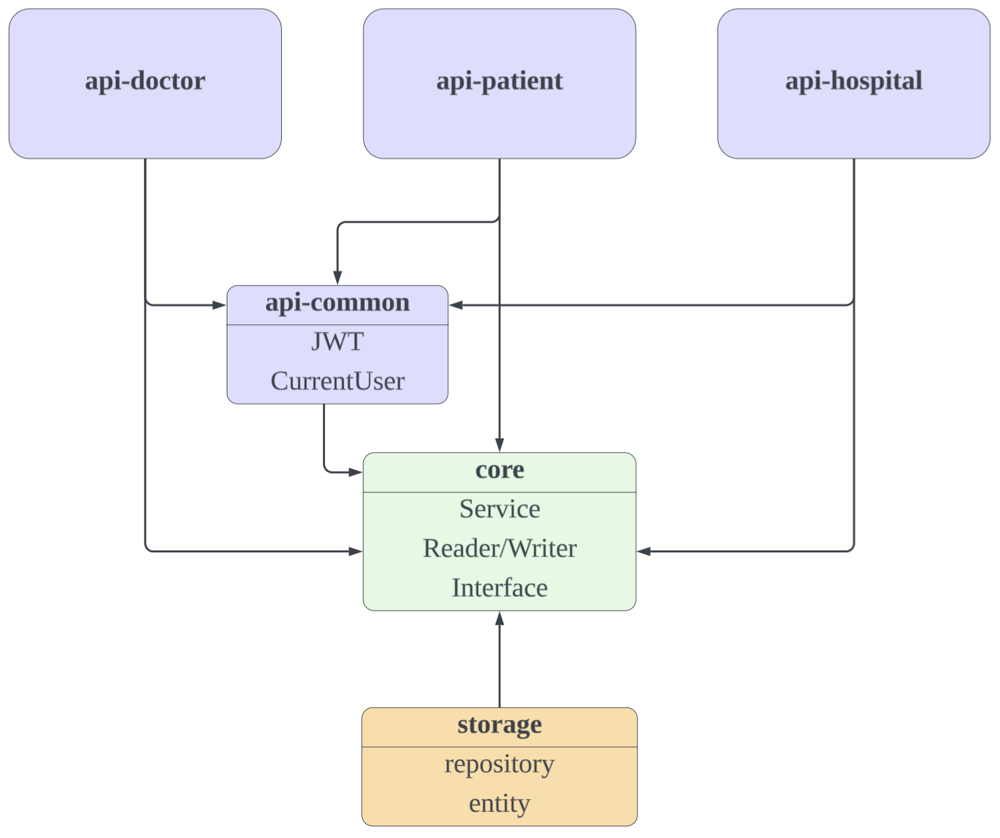

# Medicall - 방문 의료 서비스 

---

## 📋 목차
- [프로젝트 개요](#프로젝트-개요)
- [주요 기능](#주요-기능)
- [기술 스택](#기술-스택)
- [아키텍처](#아키텍처)
- [모듈 구조](#모듈-구조)
- [데이터베이스 스키마](#데이터베이스-스키마)
- [보안](#보안)
- [DTO 네이밍 컨벤션](#dto-네이밍-컨벤션)
- [코딩 컨벤션](#-코딩-컨벤션)
- [시작하기](#시작하기)

---

## 프로젝트 개요

의사와 환자, 병원을 상호 연결하는 의료 통합 플랫폼입니다.

정부의 **"일차 의료 방문 진료 수가 시범 사업"**에 영감을 받아, 거동이 불편한 환자들이 겪는 병원 방문의 어려움을 해결하고자 시작한 프로젝트입니다. 의료진과 환자를 효율적으로 연결하는 디지털 플랫폼을 통해 의료 접근성을 향상시키는 것을 목표로 합니다.

---

## 주요 기능

### 👨‍⚕️ 의사
- 예약 확인 및 방문 진행 상태 관리 (출발 → 도착 → 진료 중 → 완료)
- 진단 기록 작성 및 관리
- 의약품 검색 및 처방전 발행
- 환자 프로필 및 진료 이력 조회
- 병원 초대 코드를 통한 소속 등록

### 👤 환자
- 저장된 주소 기반 주변 병원 검색 (위치 기반)
- 병원명 및 진료과목별 병원 검색
- 배송지 성격의 주소 관리 (등록/수정/기본 주소 지정)
- 예약 요청, 예약 가능 슬롯 조회, 취소
- 처방전 조회 및 QR 코드 발급
- 진료 내역 확인

### 🏥 병원
- 소속 의료진 관리 및 초대 코드 발급
- 예약 현황 관리 (수락/거절, 의사 배정)
- 진료·처방 기록 통합 관리
- 병원 정보 및 진료과·운영시간 관리

### 💬 공통
- 의사-환자 채팅 (채팅방/메시지, 3개 API 앱 공용)
- OpenAI 기반 채팅 내용 요약

---

## 기술 스택

### Backend
- **Language**: Java 17
- **Framework**: Spring Boot 3.5.5
- **Build Tool**: Gradle 8.14.3 (Wrapper)
- **Database**: MySQL 8.x (`hibernate-spatial` 기반 위치 질의)
- **Cache / Store**: Redis 7.x
- **ORM**: Spring Data JPA, QueryDSL 5.0
- **Authentication**: Spring Security, OAuth2 Client(Kakao), JWT(jjwt 0.12.3)
- **API Docs**: springdoc-openapi 2.8.11 (Swagger UI)
- **External**: OpenAI API (채팅 요약)

### Infrastructure
- **Containerization**: Docker (멀티 스테이지 빌드, 앱별 런타임 이미지)
- **Local Infra**: Docker Compose (MySQL, Redis), Nginx

---

## 아키텍처



### 설계 철학

**모노레포 멀티모듈 아키텍처**를 채택하여 환자, 의사, 병원 각각의 독립적인 앱 서비스를 효율적으로 관리합니다.

#### 핵심 원칙
- **관심사의 분리**: API, Core, Storage 계층을 명확히 구분
- **도메인 중심 설계**: 각 도메인(Appointment, Hospital, Patient 등)별로 패키지 분리
- **재사용성**: 공통 로직은 medicall-api-common, medicall-api-chat, medicall-core에 집중

---

## 모듈 구조

```
medicall
├── medicall-api-patient    (실행 가능, 8082)
├── medicall-api-hospital   (실행 가능, 8081)
├── medicall-api-doctor     (실행 가능, 8083)
├── medicall-api-chat       (라이브러리 - 3개 API 앱에 포함)
├── medicall-api-common     (라이브러리)
├── medicall-core           (도메인/비즈니스 로직)
└── medicall-storage        (JPA / Redis 영속성)
```

### 📦 medicall-api-common
**공통 API 인프라 모듈**

- 3개의 API 앱(patient, doctor, hospital)에서 공통으로 사용하는 기능 제공
- 보안(Security), OAuth2 / JWT 인증 설정, 토큰 발급·재발급(`AuthTokenController`)
- 현재 사용자 정보 추출(`@CurrentUser`)
- 공통 예외 처리 및 응답 포맷, 헬스 체크
- **의존성**: medicall-core

### 💬 medicall-api-chat
**채팅 공통 모듈**

- 채팅방/메시지 API(`ChatController`)와 `ChatFacade` 제공
- 독립 실행이 아닌 라이브러리(`bootJar` 비활성)로, 세 API 앱이 각각 포함해 사용
- **의존성**: medicall-core, medicall-api-common, medicall-storage

### 📱 medicall-api-patient
**환자 전용 API 모듈 (port 8082)**

- Spring Boot 애플리케이션 실행 / Kakao OAuth2 로그인 진입점
- 병원·의사 검색, 예약 요청, 주소 관리, 처방전 및 QR 조회

**주요 Controller**:
```
PatientAppointmentController  - 예약 요청/조회/취소, 예약 슬롯 조회
PatientHospitalController     - 병원 검색 (위치·이름·진료과)
PatientDoctorController       - 의사 조회
PatientAddressController      - 주소 관리
PatientPrescriptionController - 처방전 조회
PrescriptionQrController      - 처방전 QR 발급/검증
PatientTreatmentController    - 진료 내역 조회
PatientController             - 환자 프로필
```

### 👨‍⚕️ medicall-api-doctor
**의사 전용 API 모듈 (port 8083)**

**주요 Controller**:
```
DoctorAppointmentController   - 예약 확인 및 방문 상태 전이
DoctorTreatmentController     - 진단 기록 작성
DoctorPrescriptionController  - 처방전 발행
DoctorMedicineController      - 의약품 검색
DoctorPatientController       - 환자 정보 조회
DoctorHospitalController      - 소속 병원 조회 / 초대 코드 등록
DoctorDepartmentController    - 진료과 조회
DoctorChatController          - 채팅
DoctorController              - 의사 프로필
```

### 🏥 medicall-api-hospital
**병원 전용 API 모듈 (port 8081)**

**주요 Controller**:
```
HospitalAppointmentController - 예약 현황 및 의사 배정
HospitalDoctorController      - 소속 의료진 관리 / 초대
HospitalTreatmentController   - 진료 기록 관리
HospitalPrescriptionController- 처방 기록 관리
HospitalDepartmentController  - 진료과 관리
HospitalPatientController     - 환자 조회
HospitalController            - 병원 정보 관리
```

### 🎯 medicall-core
**비즈니스 로직 핵심 모듈**

도메인 중심의 비즈니스 로직을 담당합니다.

**도메인**: address, appointment, chat, department, doctor, hospital, invitation, medicine, patient, prescription, treatment

**구성 요소**:
- **Domain Model**: 불변 객체(Java Record) 중심의 핵심 도메인
- **Service**: 비즈니스 로직 처리 및 트랜잭션 관리
- **Reader/Writer**: 데이터 조회 및 생성/수정 담당
- **Validator**: 비즈니스 규칙 검증
- **Repository Interface**: Storage 계층과의 인터페이스 정의

### 💾 medicall-storage
**데이터 영속성 모듈**

JPA Entity와 실제 데이터베이스·Redis 접근을 담당합니다.

**구성 요소**:
- **JPA Entity**: 데이터베이스 테이블과 매핑
- **CoreRepository**: Core의 Repository 인터페이스 구현체
- **JpaRepository / QueryDSL**: 기본 조회 및 동적 쿼리
- **Redis Store**: 처방전 QR 토큰 등 휘발성 데이터 저장

**핵심 원칙**:
- Entity ↔ Domain 변환 메서드 제공 (`toDomainModel()`)
- Core는 Storage를 컴파일 타임에 의존하지 않음 (`compileOnly`로 역방향 참조)

---

## 데이터베이스 스키마

### 주요 테이블

| 그룹 | 테이블 |
|------|--------|
| 사용자 | `doctors`, `patients`, `hospitals` |
| 진료 | `appointments`, `treatments`, `prescriptions`, `prescription_medicines` |
| 마스터 | `medicines`, `departments`, `specialties`, `hospital_departments`, `chronic_diseases` |
| 부가 정보 | `addresses`, `operating_times`, `holiday_operating_times`, `patient_chronic_diseases` |
| 채팅 | `chat_rooms`, `chat_messages` |
| 초대 | `doctor_invitations` |

### 특징

- 커서 기반 페이징
- 공간 인덱스를 활용한 거리 기반 병원 검색
- 동일 시간대 예약 중복을 막는 슬롯 유니크 제약
- 마이그레이션 SQL은 `infrastructure/db/` 에 날짜 기반으로 관리

### 주요 상태 값

```
AppointmentStatus : REQUESTED → ASSIGNED → EN_ROUTE → ARRIVED → IN_PROGRESS → COMPLETED
                    (CANCELLED / REJECTED)
PrescriptionStatus: ISSUED → DISPENSED
```
- `EN_ROUTE` 시점부터 의사 위치 공유가 시작됩니다.
- 취소는 `REQUESTED`, `ASSIGNED` 단계에서만 가능합니다.

---

## 보안
### 🔐 인증/인가

#### 소셜 로그인 + JWT 기반 토큰 인증
- Kakao OAuth2 로그인 후 서비스 토큰 발급
- Access Token: API 요청 인증
- Refresh Token: Access Token 재발급 (HttpOnly 쿠키)
- Redis 저장소: Refresh Token 관리 및 만료 처리

#### API 엔드포인트 보안
- 인증이 필요한 모든 API는 JWT 토큰 필수
- `@CurrentUser`로 인증된 사용자 정보 자동 주입
- CSRF 헤더 필터 적용
- 초대 코드 등 민감 엔드포인트에 Redis 기반 시도 횟수 제한(RateLimiter)

---

## DTO 네이밍 컨벤션

프로젝트의 일관성과 유지보수성을 위해 엄격한 DTO 네이밍 규칙을 적용합니다.

### 📐 레이어별 DTO 역할
| 레이어 | DTO 타입 | 역할 | 주요 특징 |
|--------|---------|------|----------|
| **API Layer** | Request | 외부 → 내부 데이터 전달 | - HTTP 요청 검증<br>- toCommand()/toCriteria() 제공 |
| **API Layer** | Response | 내부 → 외부 데이터 전달 | - from() 정적 팩토리 메서드<br>- 민감 정보 제외 |
| **Core Layer** | Command | 쓰기 작업 명령 | - 생성/수정/삭제 작업<br>- 불변 객체 |
| **Core Layer** | Criteria | 읽기 작업 조건 | - 조회/검색 조건<br>- 페이징 정보 포함 |
| **Core Layer** | Result | 작업 처리 결과 | - Service → API 전달<br>- 도메인 객체 조합 |


### 네이밍 패턴 빠른 참조

| 레이어 | 용도 | 네이밍 패턴 | 예시 |
|--------|------|------------|------|
| **API** | 생성 요청 | `Create[Domain][Resource]Request` | `CreatePatientAppointmentRequest` |
| **API** | 수정 요청 | `Update[Domain][Resource]Request` | `UpdatePatientAppointmentRequest` |
| **API** | 목록 조회 요청 | `[Domain][Resource]ListRequest` | `PatientAppointmentListRequest` |
| **API** | 검색 요청 | `[Domain][Resource]SearchRequest` | `PatientHospitalSearchRequest` |
| **API** | 상세 응답 | `[Domain][Resource]DetailResponse` | `PatientAppointmentDetailResponse` |
| **API** | 목록 응답 | `[Domain][Resource]ListResponse` | `PatientAppointmentListResponse` |
| **Core** | 생성 명령 | `Create[Resource]Command` | `CreateAppointmentCommand` |
| **Core** | 수정 명령 | `Update[Resource]Command` | `UpdateAppointmentCommand` |
| **Core** | 조회 조건 | `[Resource][Purpose]Criteria` | `AppointmentListCriteria` |
| **Core** | 처리 결과 | `Create[Resource]Result` | `CreateAppointmentResult` |

---

## 📝 코딩 컨벤션

### Java Style Guide
- **우아한테크코스 Java 스타일 가이드** 준수
- 4칸 스페이스 들여쓰기
- 120자 라인 길이 제한
- 모든 제어문에 중괄호 필수
- Import 순서: static → java → jakarta → org → com

### IntelliJ IDEA 설정
프로젝트 루트의 `/docs/styleguide/intellij-medicall-java-styleguide.xml` 파일을 IDE에 적용해주세요.

---

## 시작하기

### 요구 사항
- JDK 17
- Docker / Docker Compose

### 1. 인프라 실행
```bash
docker compose -f infrastructure/db/mysql/docker-compose.yml up -d
docker compose -f infrastructure/db/redis/docker-compose.yml up -d
```

### 2. 설정 파일 준비
각 모듈의 `application.yml.example` 을 복사해 실제 설정 파일을 만들고 값을 채웁니다.
(`.yml` 파일은 커밋 대상이 아닙니다.)

```bash
cp medicall-api-common/src/main/resources/application-common.yml.example \
   medicall-api-common/src/main/resources/application-common.yml
for m in patient doctor hospital; do
  cp medicall-api-$m/src/main/resources/application.yml.example \
     medicall-api-$m/src/main/resources/application.yml
done
```

채워야 하는 주요 값: DB 접속 정보, Redis 접속 정보, JWT 시크릿, Kakao OAuth client-id/secret, OpenAI API 키.

### 3. 애플리케이션 실행
```bash
./gradlew :medicall-api-patient:bootRun    # http://localhost:8082
./gradlew :medicall-api-hospital:bootRun   # http://localhost:8081
./gradlew :medicall-api-doctor:bootRun     # http://localhost:8083
```

### 4. 빌드 / 테스트
```bash
./gradlew build
./gradlew test
```

### 5. Docker 이미지 빌드
```bash
docker build --target patient-runtime -t medicall-patient .
docker build --target doctor-runtime  -t medicall-doctor .
docker build --target hospital-runtime -t medicall-hospital .
```

### API 문서
각 앱 실행 후 `http://localhost:{port}/swagger-ui/index.html` 에서 확인할 수 있습니다.

---


### Reference
<a href="https://www.flaticon.com/kr/free-icons/" title="병원 아이콘">병원 아이콘 제작자: meaicon - Flaticon</a>
